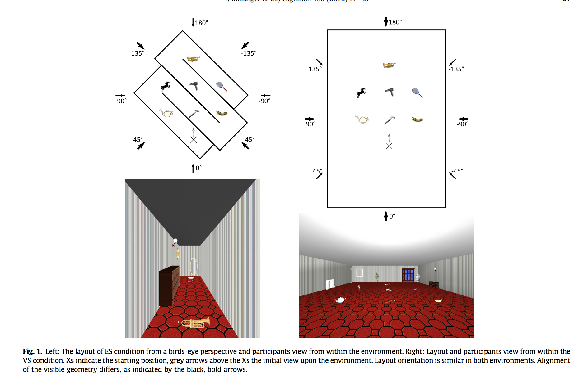

#### Article ID: Xvfpm
#### Pilot: Kyle MacDonald
#### Copilot: Mike Frank
#### Start date: Apr 27 2017
#### End date: Aug 10 2017
#### Final verification: Tom Hardwicke
#### Date: Nov 13 2017

-------

#### Methods summary: 

In this experiment, participants were tested on the location of familiar objects in a virtual room. The main experimental manipulation was whether participants learned the locations of the objects in an "Environmental Space" (ES) or a "Vista Space" (VS) as shown in Figure 1 below:



Participants completed two test tasks: pointing task (72 trials) and object placement task (1 trial). Examples of these tasks are shown in Figure 2 included below:


The main dependent variable for the pointing was "pointing latency" or the time in seconds it took participants to respond. The main predictor variable (aside from condition) was "corridor distance" which could take on values from 0-3 [within the same corridor (0), to the next corridor (1), across two (2) or three corridors (3)]. 

The main finding is an interaction between corridor distance and condition such that pointing latency increased as a function of corridor distance but only in the ES condition and not in the VS condition. This interaction is visualized in Figure 3 (note that orange represents the ES condition and blue represents the VS condition: 


The authors predicted that the ES condition would have higher point latencies because learning in this way "preserves features of the spatio-temporal learning process."

------

#### Target outcomes: 

For this article you should focus on the findings reported in section 2.2.1. Specifically, you should attempt to reproduce all descriptive and inferential analyses reported in the text below and associated tables/figures:

> Starting with the dimension of corridor distance and its influence on pointing latency, we conducted an ANOVA with the between-participant factor environment (ES vs. VS) and the within-participant factor corridor distance. A main effect of corridor distance, F(3, 66) = 5.47, p = 0.008, ηp2 = 0.20, and an interaction of corridor distance × environment, F(3, 66) = 4.58, p = 0.017, ηp2 = 0.17, but no main effect of environment, F < 1, p > 0.800, were found. Thus, the influence of corridor distance on latency differed between environments. To further examine this interaction we regressed pointing latency onto corridor distance separately for each participant. From these regressions b was extracted. This standardized slope describes the linear change of latency with increasing corridor distance for every participant. Fig. 3, top left, depicts the individual and mean slopes for the two environmental conditions. T-tests were used to analyze slopes. As expected, slopes derived from ES did exceed 0, mean b = 0.22, t(11) = 8.15, p < 0.001, d = 2.35 (see Fig. 3, top right), indicating an increase in pointing latency the more corridors are residing between current and target location. With each additional corridor pointing took on average 1.02 s (SD = 0.53) longer. In VS, which worked as the control condition where no latency increase with ascending corridor distance was expected, the mean slope did not differ from 0, mean b = 0.02, t(11) = 0.63, p = 0.542, d = 0.18. Thus, pointing did not take longer the further away targets were located with respect to corridors. Additionally, a comparison of mean slopes between ES and VS revealed that the linear increase of latency across ascending corridor distance was higher for ES compared to VS, t(22) = −4.28, p < 0.001, ds = 1.75. This pattern was also evident in individual slopes. Whereas in ES data of each single participant rendered a positive slope, in VS this was only the case for 7 out of 12 participants. Results suggest that in ES memory, the spatio-temporal pattern of learning was preserved and this was not due to the structure of the layout itself.

------

```{r global_options, include=FALSE}
knitr::opts_chunk$set(echo=TRUE, warning=FALSE, message=FALSE)

# prepare an empty report object, we will update this each time we run compareValues2()
reportObject <- data.frame("Article_ID" = NA, "valuesChecked" = 0, "eyeballs" = 0, "Total_df" = 0, "Total_p" = 0, "Total_mean" = 0, "Total_sd" = 0, "Total_se" = 0, "Total_ci" = 0, "Total_bf" = 0, "Total_t" = 0, "Total_F" = 0, "Total_es" = 0, "Total_median" = 0, "Total_irr" = 0, "Total_r" = 0, "Total_z" = 0, "Total_coeff" = 0, "Total_n" = 0, "Total_x2" = 0, "Total_other" = 0, "Insufficient_Information_Errors" = 0, "Decision_Errors" = 0, "Major_Numerical_Errors" = 0, "Minor_Numerical_Errors" = 0, "Major_df" = 0, "Major_p" = 0, "Major_mean" = 0, "Major_sd" = 0, "Major_se" = 0, "Major_ci" = 0, "Major_bf" = 0, "Major_t" = 0, "Major_F" = 0, "Major_es" = 0, "Major_median" = 0, "Major_irr" = 0, "Major_r" = 0, "Major_z" = 0, "Major_coeff" = 0, "Major_n" = 0, "Major_x2" = 0, "Major_other" = 0, "affectsConclusion" = NA, "error_typo" = 0, "error_specification" = 0, "error_analysis" = 0, "error_data" = 0, "error_unidentified" = 0, "Author_Assistance" = NA, "resolved_typo" = 0, "resolved_specification" = 0, "resolved_analysis" = 0, "resolved_data" = 0, "correctionSuggested" = NA, "correctionPublished" = NA)
```

## Step 1: Load packages

```{r}
library(tidyverse) # for data munging
library(knitr) # for kable table formating
library(haven) # import and export 'SPSS', 'Stata' and 'SAS' Files
library(readxl) # import excel files
library(CODreports) # custom report functions
library(magrittr)
library(stringr)
library(ez) # for SPSS-style anovas. 
library(broom) # for collecting regressions
```

## Step 2: Load data

The authors did not indicate which data file correspond to which experimental task. But based on the trial numbers, `data2.csv` is likely the pointing task since it has so many more trials. (This labeling can also be inferred from the codebook; perhaps filenames have been removed during the upload process).

Codebook specifies that conditions 1 and 5 are Experient 1. 

```{r}
d_placement <- read_csv("data/data1.csv")  %>%
  filter(environmentCondition_VS_1to4_ES_5 %in% c(1,5)) 

d_pointing <- read_csv("data/data2.csv") %>%
  filter(environmentCondition_VS_1to4_ES_5 %in% c(1,5)) 
```

### Data checks

Do we have 24 participants for Experiment 1? (2 minus the exclusions noted in paper)

```{r}
d_pointing %>% 
  select(subjCode) %>% 
  unique() %>% 
  nrow()

d_placement %>% 
  select(subjCode) %>% 
  unique() %>% 
  nrow()
```

We recover the expected number of participants for both. 

## Step 3: Tidy data

Extract the environment condition, position condition, and presentation condition information from the `environmentCondition_VS_1to4_ES_5` variable. From the codebook, 

> 1: VS, static position, object presentation simultaneous
2: VS, static position, object presentation successively
3: VS, movement, object presentation simultaneous
4: VS, movement, object presentation successively
5: ES, movement, object presentation successively

```{r}
d_pointing %<>% mutate(env_cond = ifelse(environmentCondition_VS_1to4_ES_5 == 1, "VS", "ES"))
```

Convert numeric `Gender_Male_1_Female_2` variable to factor with meaningful label. From the codebook,

> 1: male; 2: female

```{r}
d_pointing %<>% mutate(gender = ifelse(Gender_Male_1_Female_2 == 1, "male", "female"))
```

## Step 4: Run analysis

### Pre-processing

Exclude participants. From the paper, 

> Two participants had to be excluded. One participant did not perform significantly better than chance level (90%) in the pointing task. The other participant had to be excluded due to a lack of comprehension of task instructions. The remaining sample of 24 participants (12 for each condition) had a mean age of M = 26.09 (SD = 6.94, [19;52]) and included twelve females (seven randomly assigned to ES condition, five to VS condition). 

These participants were already excluded in the provided data.

Exclude trials. From the paper, 

> From the 24 participants approximately 4% of the pointing performance data was deleted due to deviation of more than two SD from a participant’s overall mean. 

These outliers are likely removed in the variable `absoluteError_withoutOutliers`. The percentage of null responses (coded as `#NULL!`, presumably by MS excel) is:

```{r}
d_pointing$absoluteError_withoutOutliers <- as.numeric(d_pointing$absoluteError_withoutOutliers)

dataExcluded <- mean(is.na(d_pointing$absoluteError_withoutOutliers))

dataExcluded 

# reportObject <- compareValues2(reportedValue = "4", obtainedValue = dataExcluded*100, valueType = 'n')
```

This a difference from the 4% figure here, but the authors do say "approxiately 4%", and performance could also included latency below.

We can do the same with latency, and again recover around 4%.

```{r}
d_pointing$latency_withoutOutliers <- as.numeric(d_pointing$latency_withoutOutliers)

dataExcluded <- mean(is.na(d_pointing$latency_withoutOutliers))

# reportObject <- compareValues2(reportedValue = "4", obtainedValue = dataExcluded*100, valueType = 'n')
```
So we will not consider these errors (hence commented out) because although they are vaugely described, they do not appear to be inaccurately described.

### Inferential statistics

Get a data frame. 

```{r}
d_model <- d_pointing %>%
  filter(!is.na(latency_withoutOutliers)) %>%
  select(subjCode, latency_withoutOutliers, env_cond, currentPositionNumber, targetNumber)
```

First, we need to derive `corridor distance`.

> Corridor distance distinguishes trials representing pointing within the same corridor (0), to the next corridor (1), across two (2) or three corridors (3). 

```{r}
corridor <- c(1, 2, 2, 3, 3, 4, 4)
d_model$corridor_distance <- abs(corridor[d_model$currentPositionNumber] - 
                                   corridor[d_model$targetNumber])
qplot(d_model$corridor_distance, binwidth = 1)  
```

The authors write that:

> In summary, 20 trials covered the minimum distance in terms of corridors, 29 trials covered a short distance (next corridor), 19 trials covered a medium distance (sec- ond next corridor) and 4 trials covered maximum distance. 

Our distribution looks approximately correct, but check for one subject:

```{r}
filter(d_model, subjCode == 47) %>%
  group_by(corridor_distance) %>%
  summarise(n=n())
```

Looks right, modulo some missing outlier trials. Now the ANOVA.

> ... we conducted an ANOVA with the between-participant factor environment (ES vs. VS) and the within-participant factor corridor distance. A main effect of corridor distance, F(3, 66) = 5.47, p = 0.008, ηp2 = 0.20, and an interaction of corridor distance × environment, F(3, 66) = 4.58, p = 0.017, ηp2 = 0.17, but no main effect of environment, F < 1, p > 0.800, were found. Thus, the influence of corridor distance on latency differed between environments.

```{r}
d_model$corridor_distance_factor <- factor(d_model$corridor_distance) # treated as discrete, inferred due to df.

mod <- ezANOVA(data = d_model, 
               dv = latency_withoutOutliers, 
               wid = subjCode, 
               between = env_cond, 
               within = corridor_distance_factor)

print(mod)
```

The degrees of freedom and test statistics appear to match here, but not the p-values!

```{r}
#reportObject <- compareValues2(mod$ANOVA[2,"p"], .008)
#reportObject <- compareValues2(mod$ANOVA[3,"p"], 0.017)
```

These errors both suggest that the reported p-values are actually higher than they ought to have been. 

We checked with the authors and they told us that the reported p.values, "following the Greenhouse-Geisser correction." They did note that this detail was not reported in the paper. 

```{r}
reportObject <- compareValues2(reportedValue = ".008", mod$`Sphericity Corrections`[1,"p[GG]"], valueType = 'p')
reportObject <- compareValues2(reportedValue = "0.017", mod$`Sphericity Corrections`[2,"p[GG]"], valueType = 'p')
```

When we use the corrected GG p.values, we can reproduce the results.

> To further examine this interaction we regressed pointing latency onto corridor distance separately for each participant. From these regressions b was extracted. This standardized slope describes the linear change of latency with increasing corridor distance for every participant. Fig. 3, top left, depicts the individual and mean slopes for the two environmental conditions. 

I'm confused here about how these regressions are standardized. I tried:

+ z-scoring latency before regressing: removes units on intercept, which is inconsistent with figure 3, top left
+ z-scoring corridor_distance before regressing: this centering leads to intercepts being the mean, which is inconsistent with figure 3, top left 
+ z-scoring coefficients after regressing: leads to a different bar graph in figure 3, top right, because the two conditions will be centered around zero.

We checked with the authors and they confirmed that a mix of standardized and unstandardized data were used: 

> "While figure 3, left depicts unstandardized slopes (beta) for each subject and for the learning condition (VS vs. ES) the following analysis was based on the standardized beta coefficient. Also figure 3, right depicts the mean standardized beta coefficient."

```{r}
mods <- d_model %>%
  group_by(subjCode, env_cond) %>%
  do(tidy(lm(latency_withoutOutliers/1000 ~ corridor_distance, data = .))) %>%
  select(-std.error, -statistic, -p.value) %>%
  spread(term, estimate) %>%
  rename(intercept = `(Intercept)`)

mod_mean <- mods %>%
  group_by(env_cond) %>%
  summarise(intercept = mean(intercept), 
            corridor_distance = mean(corridor_distance), 
            se_dist = sd(corridor_distance) / sqrt(n()))

ggplot(mods, aes(x = 0, y = intercept, xend = 4, 
                 yend = intercept + 4*corridor_distance, 
                 col = env_cond)) + 
  geom_segment(lty = 2) + 
  geom_segment(data = mod_mean,  lty = 1, size = 2) + 
  scale_color_manual(values = c("orange","blue"))
```
Looks quite similar to the original. 


> T-tests were used to analyze slopes. As expected, slopes derived from ES did exceed 0, mean b = 0.22, t(11) = 8.15, p < 0.001, d = 2.35 (see Fig. 3, top right), indicating an increase in pointing latency the more corridors are residing between current and target location. 

```{r}
mod_mean <- mods %>%
  group_by(env_cond) %>%
  summarise(intercept = mean(intercept),
            se_dist = sd(corridor_distance) / sqrt(n()), 
            corridor_distance = mean(corridor_distance))

ggplot(mod_mean, aes(x = env_cond, y = corridor_distance, fill = env_cond)) + 
  geom_bar(stat = "identity") + 
  geom_linerange(aes(ymin = corridor_distance - se_dist, 
                     ymax = corridor_distance + se_dist)) + 
    scale_fill_manual(values = c("orange","blue"))
```

After consulting with the authors, we learned that some analyses used standardized latencies and others did not. Here we try the T-test comparing ES slopes to zero using standardized coefficients. The authors also shared R code for getting the standardized beta coefs, which we've included here.  

```{r}
lm.beta <- function (MOD) {
  b <- summary(MOD)$coef[-1, 1]
  sx <- sd(MOD$model[[-1]])
  sy <- sd(MOD$model[[1]])
  beta <- b * sx/sy
  return(beta)
}

fit_model <- function (data_frame) {
  lm.r <- lm(latency_withoutOutliers ~ corridor_distance, data = data_frame)
  res <- tidy(lm.r)
  res[3,] <- NA
  res$term[3] <- "corridor_distance_standarizedBeta"
  res$estimate[3] <- lm.beta(lm.r)
  return(res)
}

mods.standard <- d_model %>%
  group_by(subjCode, env_cond) %>%
  do(
   fit_model(.)
  ) %>%
  select(-std.error, -statistic, -p.value) %>%
  spread(term, estimate) %>%
  rename(intercept = `(Intercept)`)

mod_mean.standard <- mods.standard %>%
  group_by(env_cond) %>%
  summarise(intercept = mean(intercept)/1000, 
            corridor_distance = mean(corridor_distance)/1000, 
            corridor_distance_standarizedBeta = mean(corridor_distance_standarizedBeta), 
            se_dist = sd(corridor_distance) / sqrt(n()))
```

T-test comparing ES slopes to zero. This non-standardized coefficient doesn't seem to work. 

```{r}
#es_coef_t <- t.test(mods$corridor_distance[mods$env_cond == "ES"])
#es_coef_t
#reportObject <- compareValues2(es_coef_t$statistic, 8.15) 
```

```{r}
es_coef_t <- t.test(mods.standard$corridor_distance_standarizedBeta[mods$env_cond == "ES"])
es_coef_t
reportObject <- compareValues2(reportedValue = "8.15", es_coef_t$statistic, 't') 
```

When we standardize the latencies, we get a match. 

> With each additional corridor pointing took on average 1.02 s (SD = 0.53) longer. 

```{r}
reportObject <- compareValues2(reportedValue = "1.02", obtainedValue = mean(mods$corridor_distance[mods$env_cond == "ES"]), valueType = 'mean')
reportObject <- compareValues2(reportedValue = ".53", obtainedValue = sd(mods$corridor_distance[mods$env_cond == "ES"]), valueType = 'sd')
```

These values both match, consistent with the use of the seconds unit (suggesting non-standardized slopes used in this descriptive). 

> In VS, which worked as the control condition where no latency increase with ascending corridor distance was expected, the mean slope did not differ from 0, mean b = 0.02,

```{r}
#mean(mods$corridor_distance[mods$env_cond == "VS"])
#reportObject <- compareValues2(mean(mods$corridor_distance[mods$env_cond == "VS"]), .02)
```

This mean does not match, and the lack of a unit suggests that this is the standardized coefficients again. 

Let's try to get this mean using the standardized slopes.

```{r}
reportObject <- compareValues2(reportedValue = ".02", mean(mods.standard$corridor_distance_standarizedBeta[mods.standard$env_cond == "VS"]), valueType = 'coeff')
```

These beta values match up when we use the model with the standardized coefficients. 

> t(11) = 0.63, p = 0.542, d = 0.18. Thus, pointing did not take longer the further away targets were located with respect to corridors. 

Check the t-test. 

```{r}
#vs_coef_t <- t.test(mods$corridor_distance[mods$env_cond == "VS"])
#vs_coef_t
#reportObject <- compareValues2(vs_coef_t$statistic, .63) 
```

Again, the general inference is the same, but coefficients don't match exactly.

Try using the standardized model.

```{r}
vs_coef_t <- t.test(mods.standard$corridor_distance_standarizedBeta[mods.standard$env_cond == "VS"])
reportObject <- compareValues2(reportedValue = ".63", vs_coef_t$statistic, 't') 
```

This t-statistic matches the reported value, although with a minor numerical difference

> Additionally, a comparison of mean slopes between ES and VS revealed that the linear increase of latency across ascending corridor distance was higher for ES compared to VS, t(22) = −4.28, p < 0.001, ds = 1.75. 

```{r}
#both_coef_t <- t.test(mods$corridor_distance[mods$env_cond == "VS"],
#                      mods$corridor_distance[mods$env_cond == "ES"])
#both_coef_t
#reportObject <- compareValues2(both_coef_t$statistic, -4.28) 
```

Again, it looks like the standardized coefficients were used, so we get a different (in this case, stronger) result. 

```{r}
both_coef_t <- t.test(mods.standard$corridor_distance_standarizedBeta[mods.standard$env_cond == "VS"],
                      mods.standard$corridor_distance_standarizedBeta[mods.standard$env_cond == "ES"])
reportObject <- compareValues2(reportedValue = "-4.28", obtainedValue = both_coef_t$statistic, valueType = 't') 
```

This t-statisic matches.

> This pattern was also evident in individual slopes. Whereas in ES data of each single participant rendered a positive slope, in VS this was only the case for 7 out of 12 participants. Results suggest that in ES memory, the spatio-temporal pattern of learning was preserved and this was not due to the structure of the layout itself.

```{r}
reportObject <- compareValues2(reportedValue = "7", sum(mods$corridor_distance[mods$env_cond == "VS"] > 0), valueType = 'n')
reportObject <- compareValues2(reportedValue = "12", sum(mods$corridor_distance[mods$env_cond == "ES"] > 0), valueType = 'n')
```

Both of these match. 

## Step 5: Conclusion

We encountered errors at first but were able to resolve them with assistance from the original authors who were very responsive and helpful. After consulting with the authors, we were able to reproduce all of the target outcomes. They pointed out that a Greenhouse-Geisser correction had been applied to the ANOVA outcomes (not reported in the paper) and agreed that the specificiation of standardized vs. unstandardized coefficients was not clearly outlined in the paper. The authors shared R code with which we could fit the standardized vs. unstandardized models.

```{r}
reportObject$Article_ID <- "Xvfpm"
reportObject$affectsConclusion <- "no"
reportObject$error_typo <- 0
reportObject$error_specification <- 0
reportObject$error_analysis <- 0
reportObject$error_data <- 0
reportObject$error_unidentified <- 0
reportObject$Author_Assistance <- T
reportObject$resolved_typo <- 0
reportObject$resolved_specification <- 2
reportObject$resolved_analysis <- 0
reportObject$resolved_data <- 0
reportObject$correctionSuggested <- "no"
reportObject$correctionPublished <- F

# decide on final outcome
if(reportObject$Decision_Errors > 0 | reportObject$Major_Numerical_Errors > 0 | reportObject$Insufficient_Information_Errors > 0){
  reportObject$finalOutcome <- "Failure"
  if(reportObject$Author_Assistance == T){
    reportObject$finalOutcome <- "Failure despite author assistance"
  }
}else{
  reportObject$finalOutcome <- "Success"
  if(reportObject$Author_Assistance == T){
    reportObject$finalOutcome <- "Success with author assistance"
  }
}

# save the report object
filename <- paste0("reportObject_", reportObject$Article_ID,".csv")
write_csv(reportObject, filename)
```

## Report Object

```{r, echo = FALSE}
# display report object in chunks
kable(reportObject[2:10], align = 'l')
kable(reportObject[11:20], align = 'l')
kable(reportObject[21:25], align = 'l')
kable(reportObject[26:30], align = 'l')
kable(reportObject[31:35], align = 'l')
kable(reportObject[36:40], align = 'l')
kable(reportObject[41:45], align = 'l')
kable(reportObject[46:51], align = 'l')
kable(reportObject[52:57], align = 'l')
```

## Session information

```{r session_info, include=TRUE, echo=TRUE, results='markup'}
devtools::session_info()
```
