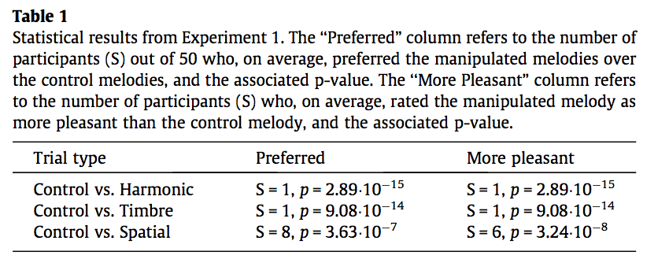

#### Article ID: DRaKS
#### Pilot: Kyle MacDonald
#### Co-pilot: Tom Hardwicke  
#### Start date: 7/11/17
#### End date: [Insert end date - use US format]   

-------

#### Methods summary: 
[Write a brief summary of the methods underlying the target outcomes written in your own words]

------

#### Target outcomes: 

For this article you should focus on the findings reported for Experiment 1 in section 2.2 (also refer to section 2.1.4.). Specifically, you should attempt to reproduce all descriptive and inferential analyses reported in the text below and associated tables/figures:

> As shown in Table 1, for each of the pitch, timbre and spatial deviant conditions, participants greatly preferred the control melodies to the altered melodies. There were no significant correlations between musical training and either the preference or pleasantness measures for any of the manipulation comparisons (all Pearson’s r’s < 0.2, all p’s > 0.20).

Here is the relevant table from the paper: 



------

```{r global_options, include=FALSE}
knitr::opts_chunk$set(echo=TRUE, warning=FALSE, message=FALSE)
```

## Step 1: Load packages

```{r}
library(tidyverse) # for data munging
library(knitr) # for kable table formating
library(haven) # import and export 'SPSS', 'Stata' and 'SAS' Files
library(readxl) # import excel files
library(CODreports) # custom report functions
library(magrittr) # for compound pipes
library(stringr) # for working with strings
```

## Step 2: Load data

```{r}
d1 <- read_csv("data/data1.csv")
d2 <- read_csv("data/data1.csv")
```

Check the structure of the data.

```{r}
glimpse(d1)
```

Check how many participants we have in the data file.

```{r}
n_e1 <- 50

d1 %>% 
  filter(Include == 1) %>% 
  distinct(subjects) %>% 
  nrow() == n_e1
```

Do we have 72 trials for each participant? 

> Each participant completed 36 trials (12 melodies 3 deviant conditions) twice in a different random order each time, for a total of 72 trials.

```{r}
n_trials_e1 <- 72
n_participants <- 52

d1 %>% 
  group_by(subjects) %>% 
  count() %>% 
  mutate(full_data = n == n_trials_e1) %>% 
  pull(full_data) %>% 
  sum() == n_participants
```

Yes, but it looks like some data is filtered at the trial level, which is not mentioned in the paper. 

## Step 3: Tidy data

Data were already in a tidy format. 

## Step 4: Run analysis

### Pre-processing

Average data across participants and conditions.

> We averaged the responses across trials for each participant. This yielded (i) a proportion of trials on which participants preferred the manipulated stimulus, and (ii) a proportion of trials on which participants selected the manipulated stimulus as more pleasant.

```{r}

```

Classify participants by whether they preferred the manipulated or non-manipulated melodies

> Because the proportion data were not normally distributed, subjects were classified as to whether they, on average, preferred the manipulated or non-manipulated melody.

```{r}

```


### Descriptive statistics

Reproduce the values for S reported in Table 1. S refers to to the number of participants (s_preferred) out of 50 who, on average, preferred the manipulated melodies over the control melodies, and the number of participants (s_pleasant) who, on average, rated the manipulated melody as more pleasant than the control melody.

```{r}
```

### Inferential statistics

Perform hypothesis tests using the Sign test and BSDA package. 

> Sign tests as implemented in R (R Development Core Team, 2014) supple- mented with the BSDA package (Arnholt, 2012) were used to test whether the number of participants who exceeded an expected preference or pleasantness proportion of 0.5 was greater (or less) than expected by chance. This yields the S statistic, which is the number of participants above the expected median (i.e., with proportion scores >0.5 under the null hypothesis). Under the null hypothesis, S is equal to n/2. P-values represent the binomial probability of S statistics at least as extreme as that observed (Maxwell & Delaney, 2004).


```{r}

```

## Step 5: Conclusion

```{r}
codReport(Report_Type = 'pilot',
          Article_ID = 'DRaKS', 
          Insufficient_Information_Errors = 0,
          Decision_Errors = 0, 
          Major_Numerical_Errors = 0, 
          Minor_Numerical_Errors = 0)
```

[Please also include a brief text summary describing your findings. If this reproducibility check was a failure, you should note any suggestions as to what you think the likely cause(s) might be.]

[This function will output information about the package versions used in this report:]

```{r session_info, include=TRUE, echo=TRUE, results='markup'}
devtools::session_info()
```
