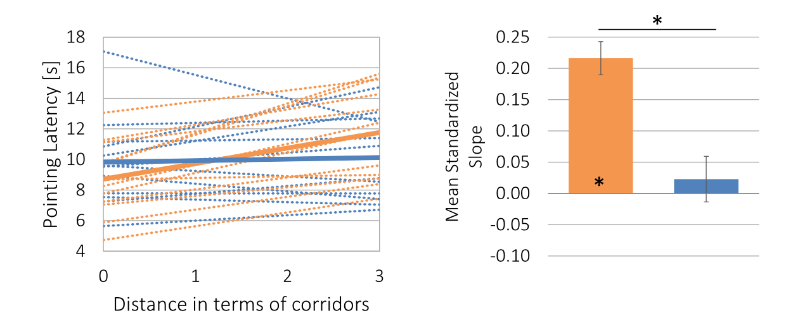

#### Article ID: Xvfpm
#### Pilot: Kyle MacDonald
#### Start date: 4/27/17
#### End date: [Insert end date - use US format]   

-------

#### Methods summary: 

In this experiment, participants were tested on the location of familiar objects in a virtual room. The main experimental manipulation was whether participants learned the locations of the objects in an "Environmental Space" (ES) or a "Vista Space" (VS) as shown in Figure 1 below:


Participants completed two test tasks: pointing task (72 trials) and object placement task (1 trial). Examples of these tasks are shown in Figure 2 included below:


The main dependent variable for the pointing was "pointing latency" or the time in seconds it took participants to respond. The main predictor variable (aside from condition) was "corridor distance" which could take on values from 0-3 [within the same corridor (0), to the next corridor (1), across two (2) or three corridors (3)]. 

The main finding is an interaction between corridor distance and condition such that pointing latency increased as a function of corridor distance but only in the ES condition and not in the VS condition. This interaction is visualized in Figure 3 (note that orange represents the ES condition and blue represents the VS condition: 



The authors predicted that the ES condition would have higher point latencies because learning in this way "preserves features of the spatio-temporal learning process."

------

#### Target outcomes: 

For this article you should focus on the findings reported in section 2.2.1. Specifically, you should attempt to reproduce all descriptive and inferential analyses reported in the text below and associated tables/figures:

> Starting with the dimension of corridor distance and its influence on pointing latency, we conducted an ANOVA with the between-participant factor environment (ES vs. VS) and the within-participant factor corridor distance. A main effect of corridor distance, F(3, 66) = 5.47, p = 0.008, ηp2 = 0.20, and an interaction of corridor distance × environment, F(3, 66) = 4.58, p = 0.017, ηp2 = 0.17, but no main effect of environment, F < 1, p > 0.800, were found. Thus, the influence of corridor distance on latency differed between environments. To further examine this interaction we regressed pointing latency onto corridor distance separately for each participant. From these regressions b was extracted. This standardized slope describes the linear change of latency with increasing corridor distance for every participant. Fig. 3, top left, depicts the individual and mean slopes for the two environmental conditions. T-tests were used to analyze slopes. As expected, slopes derived from ES did exceed 0, mean b = 0.22, t(11) = 8.15, p < 0.001, d = 2.35 (see Fig. 3, top right), indicating an increase in pointing latency the more corridors are residing between current and target location. With each additional corridor pointing took on average 1.02 s (SD = 0.53) longer. In VS, which worked as the control condition where no latency increase with ascending corridor distance was expected, the mean slope did not differ from 0, mean b = 0.02, t(11) = 0.63, p = 0.542, d = 0.18. Thus, pointing did not take longer the further away targets were located with respect to corridors. Additionally, a comparison of mean slopes between ES and VS revealed that the linear increase of latency across ascending corridor distance was higher for ES compared to VS, t(22) = −4.28, p < 0.001, ds = 1.75. This pattern was also evident in individual slopes. Whereas in ES data of each single participant rendered a positive slope, in VS this was only the case for 7 out of 12 participants. Results suggest that in ES memory, the spatio-temporal pattern of learning was preserved and this was not due to the structure of the layout itself.

------

```{r global_options, include=FALSE}
knitr::opts_chunk$set(echo=TRUE, warning=FALSE, message=FALSE)
```

## Step 1: Load packages

```{r}
library(tidyverse) # for data munging
library(knitr) # for kable table formating
library(haven) # import and export 'SPSS', 'Stata' and 'SAS' Files
library(readxl) # import excel files
library(CODreports) # custom report functions
library(magrittr)
library(stringr)
```

## Step 2: Load data

The authors did not indicate which data file correspond to which experimental task. But based on the trial numbers, `data2.csv` is likely the pointing task since it has so many more trials.

```{r}
d <- read_csv("data/data1.csv")
d2 <- read_csv("data/data2.csv") 
```

### Data checks

Do we have 26 participants for Experiment 1? 

```{r}
n_expect <- 26

n_obtained <- d2 %>% 
  select(subjCode) %>% 
  unique() %>% 
  nrow()

n_expect_output <- n_expect == n_obtained
```

The output of the expected N test is: `r n_expect_output`, meaning we do not have the expected number of participants. In `data2.csv` there are `r n_obtained` unique participants. 

INSUFFICIENT INFORMATION ERROR

I am not sure how to tell whether participants were in Experiment 1 or Experiment 2 since this information does not seem to be encoded in the data file. Without this information, I cannot complete the reproducibility check.

## Step 3: Tidy data

Extract the environment condition, position condition, and presendation condition information from the `environmentCondition_VS_1to4_ES_5` variable. From the codebook, 

> 1: VS, static position, object presentation simultaneous
2: VS, static position, object presentation successively
3: VS, movement, object presentation simultaneous
4: VS, movement, object presentation successively
5: ES, movement, object presentation successively

```{r}
d.tidy <- d2 %>% 
  mutate(env_cond = ifelse(environmentCondition_VS_1to4_ES_5 %in% c(1:4), "VS", "ES"),
         pos_cond = ifelse(environmentCondition_VS_1to4_ES_5 %in% c(1:2), "static", "movement"),
         present_cond = ifelse(environmentCondition_VS_1to4_ES_5 %in% c(1,3), 
                               "simultaneous", "successive"))
```

Convert numeric `Gender_Male_1_Female_2` variable to factor with meaningful label. From the codebook,

> 1: male; 2: female

```{r}
d.tidy %<>% mutate(gender = ifelse(Gender_Male_1_Female_2 == 1, "male", "female"))
```

## Step 4: Run analysis

### Pre-processing

Exclude participants. From the paper, 

> Two participants had to be excluded. One participant did not perform significantly better than chance level (90) in the pointing task. The other participant had to be excluded due to a lack of comprehension of task instructions. The remaining sample of 24 participants (12 for each condition) had a mean age of M = 26.09 (SD = 6.94, [19;52]) and included twelve females (seven randomly assigned to ES condition, five to VS condition). 

```{r}
```

Exclude trials. From the paper, 

> From the 24 participants approximately 4% of the pointing per- formance data was deleted due to deviation of more than two SD from a participant’s overall mean. 

```{r}

```

Correct for nonsphercity. From the paper, 

> All tests conducted were corrected for nonsphericity or inequality of variance when appropriate.


### Descriptive statistics

```{r}
```

### Inferential statistics

```{r}
```

## Step 5: Conclusion

```{r}
codReport(Report_Type = 'pilot',
          Article_ID = 'Xvfpm', 
          Insufficient_Information_Errors = 1,
          Decision_Errors = 0, 
          Major_Numerical_Errors = 0, 
          Minor_Numerical_Errors = 0)
```

I ran into difficulty early in this reproducbility report. The issue is that I am not sure how to tell whether participants completed Experiment 1 or Experiment 2 since this information does not seem to be encoded in the data file. Without this information, I couldn't complete the reproducibility check.

```{r session_info, include=TRUE, echo=TRUE, results='markup'}
devtools::session_info()
```
