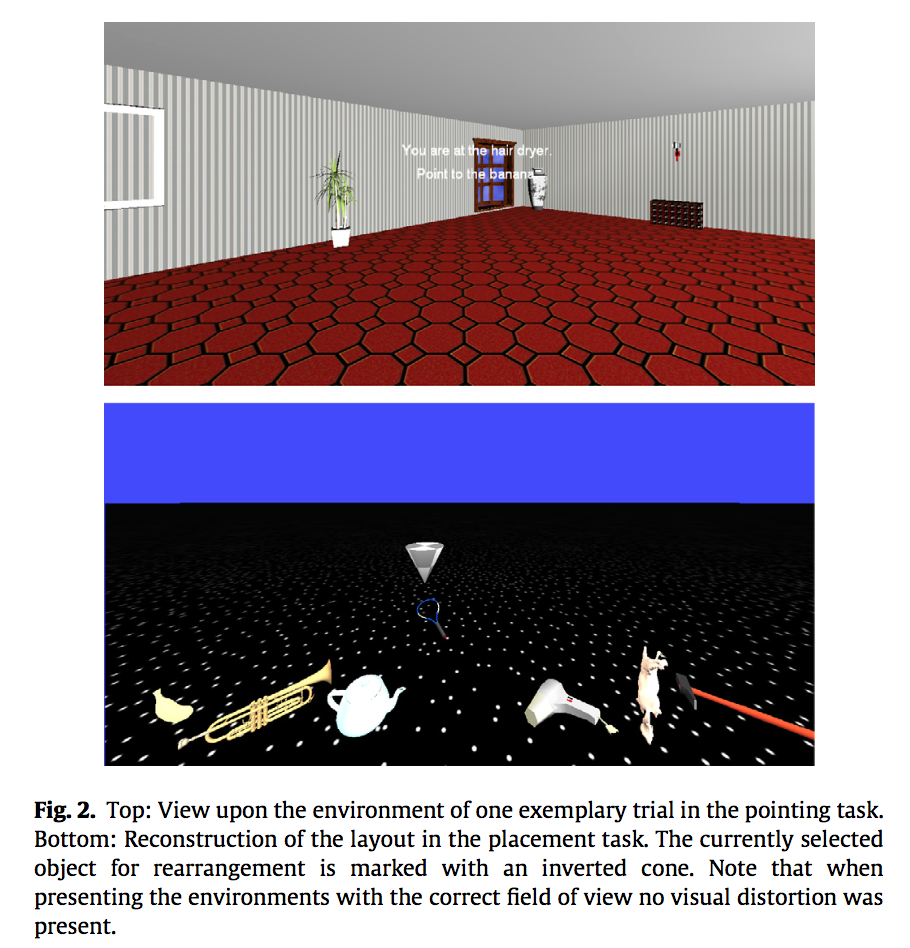

#### Article ID: Xvfpm
#### Pilot: Kyle MacDonald
#### Start date: 4/27/17
#### End date: [Insert end date - use US format]   
-------

#### Methods summary: 

<<<<<<< HEAD
In this experiment, participants were tested on the location of familiar objects in a virtual room. The main experimental manipulation was whether participants learned the locations of the objects in an "Environmental Space" (ES) or a "Vista Space" (VS) as shown in Figure 1 below:


Participants completed two test tasks: pointing task (72 trials) and object placement task (1 trial). Examples of these tasks are shown in Figure 2 included below:



The main dependent variable for the pointing was "pointing latency" or the time in seconds it took participants to respond. The main predictor variable (aside from condition) was "corridor distance" which could take on values from 0-3 [within the same corridor (0), to the next corridor (1), across two (2) or three corridors (3)]. 

The main finding is an interaction between corridor distance and condition such that pointing latency increased as a function of corridor distance but only in the ES condition and not in the VS condition. This interaction is visualized in Figure 3 (note that orange represents the ES condition and blue represents the VS condition: 


The authors predicted that the ES condition would have higher point latencies because learning in this way "preserves features of the spatio-temporal learning process."

------

#### Target outcomes: 

For this article you should focus on the findings reported in section 2.2.1. Specifically, you should attempt to reproduce all descriptive and inferential analyses reported in the text below and associated tables/figures:

> Starting with the dimension of corridor distance and its influence on pointing latency, we conducted an ANOVA with the between-participant factor environment (ES vs. VS) and the within-participant factor corridor distance. A main effect of corridor distance, F(3, 66) = 5.47, p = 0.008, ηp2 = 0.20, and an interaction of corridor distance × environment, F(3, 66) = 4.58, p = 0.017, ηp2 = 0.17, but no main effect of environment, F < 1, p > 0.800, were found. Thus, the influence of corridor distance on latency differed between environments. To further examine this interaction we regressed pointing latency onto corridor distance separately for each participant. From these regressions b was extracted. This standardized slope describes the linear change of latency with increasing corridor distance for every participant. Fig. 3, top left, depicts the individual and mean slopes for the two environmental conditions. T-tests were used to analyze slopes. As expected, slopes derived from ES did exceed 0, mean b = 0.22, t(11) = 8.15, p < 0.001, d = 2.35 (see Fig. 3, top right), indicating an increase in pointing latency the more corridors are residing between current and target location. With each additional corridor pointing took on average 1.02 s (SD = 0.53) longer. In VS, which worked as the control condition where no latency increase with ascending corridor distance was expected, the mean slope did not differ from 0, mean b = 0.02, t(11) = 0.63, p = 0.542, d = 0.18. Thus, pointing did not take longer the further away targets were located with respect to corridors. Additionally, a comparison of mean slopes between ES and VS revealed that the linear increase of latency across ascending corridor distance was higher for ES compared to VS, t(22) = −4.28, p < 0.001, ds = 1.75. This pattern was also evident in individual slopes. Whereas in ES data of each single participant rendered a positive slope, in VS this was only the case for 7 out of 12 participants. Results suggest that in ES memory, the spatio-temporal pattern of learning was preserved and this was not due to the structure of the layout itself.

------

```{r global_options, include=FALSE}
knitr::opts_chunk$set(echo=TRUE, warning=FALSE, message=FALSE)
```

## Step 1: Load packages

```{r}
library(tidyverse) # for data munging
library(knitr) # for kable table formating
library(haven) # import and export 'SPSS', 'Stata' and 'SAS' Files
library(readxl) # import excel files
library(CODreports) # custom report functions
library(magrittr)
library(stringr)
```

## Step 2: Load data

<<<<<<< HEAD
The authors did not indicate which data file correspond to which experimental task. But based on the trial numbers, `data2.csv` is likely the pointing task since it has so many more trials.

```{r}
d <- read_csv("data/data1.csv")
d2 <- read_csv("data/data2.csv") 
```

### Data checks

Do we have 26 participants for Experiment 1? 

```{r}
n_expect <- 26

n_obtained <- d2 %>% 
  select(subjCode) %>% 
  unique() %>% 
  nrow()

n_expect_output <- n_expect == n_obtained
```

The output of the expected N test is: `r n_expect_output`, meaning we do not have the expected number of participants. In `data2.csv` there are `r n_obtained` unique participants. 

INSUFFICIENT INFORMATION ERROR

I am not sure how to tell whether participants were in Experiment 1 or Experiment 2 since this information does not seem to be encoded in the data file. Without this information, I cannot complete the reproducibility check.

## Step 3: Tidy data

Extract the environment condition, position condition, and presentation condition information from the `environmentCondition_VS_1to4_ES_5` variable. From the codebook, 

> 1: VS, static position, object presentation simultaneous
2: VS, static position, object presentation successively
3: VS, movement, object presentation simultaneous
4: VS, movement, object presentation successively
5: ES, movement, object presentation successively

```{r}
d.tidy <- d2 %>% 
  mutate(env_cond = ifelse(environmentCondition_VS_1to4_ES_5 %in% c(1:4), "VS", "ES"),
         pos_cond = ifelse(environmentCondition_VS_1to4_ES_5 %in% c(1:2), "static", "movement"),
         present_cond = ifelse(environmentCondition_VS_1to4_ES_5 %in% c(1,3), 
                               "simultaneous", "successive"))
```

Convert numeric `Gender_Male_1_Female_2` variable to factor with meaningful label. From the codebook,

> 1: male; 2: female

```{r}
d.tidy %<>% mutate(gender = ifelse(Gender_Male_1_Female_2 == 1, "male", "female"))
```

## Step 4: Run analysis

### Pre-processing

Exclude participants. From the paper, 

> Two participants had to be excluded. One participant did not perform significantly better than chance level (90) in the pointing task. The other participant had to be excluded due to a lack of comprehension of task instructions. The remaining sample of 24 participants (12 for each condition) had a mean age of M = 26.09 (SD = 6.94, [19;52]) and included twelve females (seven randomly assigned to ES condition, five to VS condition). 

```{r}
```

Exclude trials. From the paper, 

> From the 24 participants approximately 4% of the pointing per- formance data was deleted due to deviation of more than two SD from a participant’s overall mean. 

```{r}

```

Correct for nonsphercity. From the paper, 

> All tests conducted were corrected for nonsphericity or inequality of variance when appropriate.


### Descriptive statistics

```{r}
```

### Inferential statistics

```{r}
```

=======
```{r}
d1 <- read_csv("data/data1.csv")
```

Check the structure of the data.

```{r}
glimpse(d1)
```

Check how many participants we have in the data file.

> Participants were 50 undergraduate students

The authors did not report filtering two participants in the paper. 

```{r}
n_e1 <- 50

d1 %>% 
  filter(Include == 1) %>% 
  distinct(subjects) %>% 
  nrow() == n_e1
```

Do we have 72 trials for each participant? 

> Each participant completed 36 trials (12 melodies 3 deviant conditions) twice in a different random order each time, for a total of 72 trials.

```{r}
n_trials_e1 <- 72
n_participants <- 52

d1 %>% 
  group_by(subjects) %>% 
  count() %>% 
  mutate(full_data = n == n_trials_e1) %>% 
  pull(full_data) %>% 
  sum() == n_participants
```

Yes, but it looks like some data is filtered at the trial level, which is not mentioned in the paper. 

## Step 3: Tidy data

Data were already in a tidy format. But we need to remove the participants that were not included in the analyses. From the supplementary codebook:

> Include: Whether participant data were included (1) or excluded (0) from the analysis due to technical difficulties during data collection or withdrawal from the experiment.

```{r}
d_analysis <- d1 %>% filter(Include == 1)
```


## Step 4: Run analysis

### Pre-processing

Average data for each participant and condition. From the analysis plan section:

> We averaged the responses across trials for each participant. This yielded (i) a proportion of trials on which participants preferred the manipulated stimulus, and (ii) a proportion of trials on which participants selected the manipulated stimulus as more pleasant.

Note that participants' responses were coded using a 0/1 dummy coding scheme:

> Preference: Binary response indicating whether (1) or not (0) the participant preferred the stimulus predicted by the Source-Dilemma Hypothesis. Unpleasantness: Binary response indicating whether (1) or not (0) the participant found more unpleasant the stimulus predicted by the Source-Dilemma Hypothesis

Note that this coding schedule is a bit underspecified since we have to know the predictions of the Source-Dilemma Hypothesis to map 1 and 0 to behaviors. Here's the relevant prediction from the paper: 

> We therefore predicted that manipulated melodies would be perceived as less pleasant than the standard melodies because listeners would encounter perceptual incoherence in the former.

```{r}
d_ss <- d_analysis %>% 
  group_by(subjects, manipulation) %>% 
  summarise(m_prefer_control = mean(Preference),
            m_unpleasant_control = mean(Unpleasant))
```

Classify participants by whether they preferred the manipulated or non-manipulated melodies

> Because the proportion data were not normally distributed, subjects were classified as to whether they, on average, preferred the manipulated or non-manipulated melody.

This classification scheme is a little underspecified. I interpreted "on average" to mean $M_{score} <= 0.5$ since I think "1" was coded as preferring the manipulated melodies.

```{r}
d_ss %<>% 
  mutate(prefer_manipulated = ifelse(m_prefer_control <= 0.5, TRUE, FALSE),
         pleasant_manipulated = ifelse(m_unpleasant_control <= 0.5, TRUE, FALSE))
```


### Descriptive statistics

Reproduce the values for S reported in Table 1. S refers to to the number of participants (s_preferred) out of 50 who, on average, preferred the manipulated melodies over the control melodies, and the number of participants (s_pleasant) who, on average, rated the manipulated melody as more pleasant than the control melody.

```{r}
table1 <- d_ss %>% 
  group_by(manipulation) %>% 
  summarise(n_prefer_manipulated= sum(prefer_manipulated),
            n_unpleasant_control = sum(pleasant_manipulated)) %>% 
  mutate(manipulation = forcats::fct_recode(manipulation, 
                                            harmonic = "H", 
                                            spatial = "S",
                                            timbre = "T"))

table1 %>% kable()
```

I was able to reproduce the reported values. 

### Inferential statistics

Perform hypothesis tests using the Sign test and BSDA package. 

> Sign tests as implemented in R (R Development Core Team, 2014) supple- mented with the BSDA package (Arnholt, 2012) were used to test whether the number of participants who exceeded an expected preference or pleasantness proportion of 0.5 was greater (or less) than expected by chance. This yields the S statistic, which is the number of participants above the expected median (i.e., with proportion scores >0.5 under the null hypothesis). Under the null hypothesis, S is equal to n/2. P-values represent the binomial probability of S statistics at least as extreme as that observed (Maxwell & Delaney, 2004).


I haven't used the Sign test or BSDA package before, so I followed the steps in [this](https://onlinecourses.science.psu.edu/stat464/node/49) tutorial.

  * x - is the object where you store your data
  * md - the hypothesized median (default is 0)
  * alternative - either "two.sided", "greater", or "less than"
  * conf.level  - the desired confidence level. 

Note that the SIGN.test function in the BSDA package does not actually return the p_values, so I created my own version of the function (following [this](https://stackoverflow.com/questions/19644695/extracting-p-value-sign-test-package-bsda-in-r) Stack Overflow post) that does in order to make this analysis fully reproducible. 

```{r my sign.test fun}
km_sign_test_fun <- function (x, y = NULL, md = 0, alternative = "two.sided", conf.level = 0.95) {
    choices <- c("two.sided", "greater", "less")
    alt <- pmatch(alternative, choices)
    alternative <- choices[alt]
    if (length(alternative) > 1 || is.na(alternative)) 
        stop("alternative must be one \"greater\", \"less\", \"two.sided\"")
    if (!missing(md)) 
        if (length(md) != 1 || is.na(md)) 
            stop("median must be a single number")
    if (!missing(conf.level)) 
        if (length(conf.level) != 1 || is.na(conf.level) || conf.level < 
            0 || conf.level > 1) 
            stop("conf.level must be a number between 0 and 1")
    if (is.null(y)) {
        dname <- paste(deparse(substitute(x)))
        x <- sort(x)
        diff <- (x - md)
        n <- length(x)
        nt <- length(x) - sum(diff == 0)
        s <- sum(diff > 0)
        estimate <- median(x)
        method <- c("One-sample Sign-Test")
        names(estimate) <- c("median of x")
        names(md) <- "median"
        names(s) <- "s"
        CIS <- "Conf Intervals"
        if (alternative == "less") {
            pval <- sum(dbinom(0:s, nt, 0.5))
            loc <- c(0:n)
            prov <- (dbinom(loc, n, 0.5))
            k <- loc[cumsum(prov) > (1 - conf.level)][1]
            if (k < 1) {
                conf.level <- (1 - (sum(dbinom(k, n, 0.5))))
                xl <- -Inf
                xu <- x[n]
                ici <- c(xl, xu)
            }
            else {
                ci1 <- c(-Inf, x[n - k + 1])
                acl1 <- (1 - (sum(dbinom(0:k - 1, n, 0.5))))
                ci2 <- c(-Inf, x[n - k])
                acl2 <- (1 - (sum(dbinom(0:k, n, 0.5))))
                xl <- -Inf
                xu <- (((x[n - k + 1] - x[n - k]) * (conf.level - 
                  acl2))/(acl1 - acl2)) + x[n - k]
                ici <- c(xl, xu)
            }
        }
        else if (alternative == "greater") {
            pval <- (1 - sum(dbinom(0:s - 1, nt, 0.5)))
            loc <- c(0:n)
            prov <- (dbinom(loc, n, 0.5))
            k <- loc[cumsum(prov) > (1 - conf.level)][1]
            if (k < 1) {
                conf.level <- (1 - (sum(dbinom(k, n, 0.5))))
                xl <- x[1]
                xu <- Inf
                ici <- c(xl, xu)
            }
            else {
                ci1 <- c(x[k], Inf)
                acl1 <- (1 - (sum(dbinom(0:k - 1, n, 0.5))))
                ci2 <- c(x[k + 1], Inf)
                acl2 <- (1 - (sum(dbinom(0:k, n, 0.5))))
                xl <- (((x[k] - x[k + 1]) * (conf.level - acl2))/(acl1 - 
                  acl2)) + x[k + 1]
                xu <- Inf
                ici <- c(xl, xu)
            }
        }
        else {
            p1 <- sum(dbinom(0:s, nt, 0.5))
            p2 <- (1 - sum(dbinom(0:s - 1, nt, 0.5)))
            pval <- min(2 * p1, 2 * p2, 1)
            loc <- c(0:n)
            prov <- (dbinom(loc, n, 0.5))
            k <- loc[cumsum(prov) > (1 - conf.level)/2][1]
            if (k < 1) {
                conf.level <- (1 - 2 * (sum(dbinom(k, n, 0.5))))
                xl <- x[1]
                xu <- x[n]
                ici <- c(xl, xu)
            }
            else {
                ci1 <- c(x[k], x[n - k + 1])
                acl1 <- (1 - 2 * (sum(dbinom(0:k - 1, n, 0.5))))
                ci2 <- c(x[k + 1], x[n - k])
                acl2 <- (1 - 2 * (sum(dbinom(0:k, n, 0.5))))
                xl <- (((x[k] - x[k + 1]) * (conf.level - acl2))/(acl1 - 
                  acl2)) + x[k + 1]
                xu <- (((x[n - k + 1] - x[n - k]) * (conf.level - 
                  acl2))/(acl1 - acl2)) + x[n - k]
                ici <- c(xl, xu)
            }
        }
    }
    else {
        if (length(x) != length(y)) 
            stop("Length of x must equal length of y")
        xy <- sort(x - y)
        diff <- (xy - md)
        n <- length(xy)
        nt <- length(xy) - sum(diff == 0)
        s <- sum(diff > 0)
        dname <- paste(deparse(substitute(x)), " and ", deparse(substitute(y)), 
            sep = "")
        estimate <- median(xy)
        method <- c("Dependent-samples Sign-Test")
        names(estimate) <- c("median of x-y")
        names(md) <- "median difference"
        names(s) <- "S"
        CIS <- "Conf Intervals"
        if (alternative == "less") {
            pval <- sum(dbinom(0:s, nt, 0.5))
            loc <- c(0:n)
            prov <- (dbinom(loc, n, 0.5))
            k <- loc[cumsum(prov) > (1 - conf.level)][1]
            if (k < 1) {
                conf.level <- (1 - (sum(dbinom(k, n, 0.5))))
                xl <- -Inf
                xu <- xy[n]
                ici <- c(xl, xu)
            }
            else {
                ci1 <- c(-Inf, xy[n - k + 1])
                acl1 <- (1 - (sum(dbinom(0:k - 1, n, 0.5))))
                ci2 <- c(-Inf, xy[n - k])
                acl2 <- (1 - (sum(dbinom(0:k, n, 0.5))))
                xl <- -Inf
                xu <- (((xy[n - k + 1] - xy[n - k]) * (conf.level - 
                  acl2))/(acl1 - acl2)) + xy[n - k]
                ici <- c(xl, xu)
            }
        }
        else if (alternative == "greater") {
            pval <- (1 - sum(dbinom(0:s - 1, nt, 0.5)))
            loc <- c(0:n)
            prov <- (dbinom(loc, n, 0.5))
            k <- loc[cumsum(prov) > (1 - conf.level)][1]
            if (k < 1) {
                conf.level <- (1 - (sum(dbinom(k, n, 0.5))))
                xl <- xy[1]
                xu <- Inf
                ici <- c(xl, xu)
            }
            else {
                ci1 <- c(xy[k], Inf)
                acl1 <- (1 - (sum(dbinom(0:k - 1, n, 0.5))))
                ci2 <- c(xy[k + 1], Inf)
                acl2 <- (1 - (sum(dbinom(0:k, n, 0.5))))
                xl <- (((xy[k] - xy[k + 1]) * (conf.level - acl2))/(acl1 - 
                  acl2)) + xy[k + 1]
                xu <- Inf
                ici <- c(xl, xu)
            }
        }
        else {
            p1 <- sum(dbinom(0:s, nt, 0.5))
            p2 <- (1 - sum(dbinom(0:s - 1, nt, 0.5)))
            pval <- min(2 * p1, 2 * p2, 1)
            loc <- c(0:n)
            prov <- (dbinom(loc, n, 0.5))
            k <- loc[cumsum(prov) > (1 - conf.level)/2][1]
            if (k < 1) {
                conf.level <- (1 - 2 * (sum(dbinom(k, n, 0.5))))
                xl <- xy[1]
                xu <- xy[n]
                ici <- c(xl, xu)
            }
            else {
                ci1 <- c(xy[k], xy[n - k + 1])
                acl1 <- (1 - 2 * (sum(dbinom(0:k - 1, n, 0.5))))
                ci2 <- c(xy[k + 1], xy[n - k])
                acl2 <- (1 - 2 * (sum(dbinom(0:k, n, 0.5))))
                xl <- (((xy[k] - xy[k + 1]) * (conf.level - acl2))/(acl1 - 
                  acl2)) + xy[k + 1]
                xu <- (((xy[n - k + 1] - xy[n - k]) * (conf.level - 
                  acl2))/(acl1 - acl2)) + xy[n - k]
                ici <- c(xl, xu)
            }
        }
    }
    if (k < 1) {
        cint <- ici
        attr(cint, "conf.level") <- conf.level
        rval <- structure(list(statistic = s, p.value = pval, 
            estimate = estimate, null.value = md, alternative = alternative, 
            method = method, data.name = dname, conf.int = cint))
        oldClass(rval) <- "htest"
        return(rval)
    }
    else {
        result1 <- c(acl2, ci2)
        result2 <- c(conf.level, ici)
        result3 <- c(acl1, ci1)
        Confidence.Intervals <- round(as.matrix(rbind(result1, 
            result2, result3)), 4)
        cnames <- c("Conf.Level", "L.E.pt", "U.E.pt")
        rnames <- c("Lower Achieved CI", "Interpolated CI", "Upper Achieved CI")
        dimnames(Confidence.Intervals) <- list(rnames, cnames)
        cint <- ici
        attr(cint, "conf.level") <- conf.level
        rval <- structure(list(statistic = s, parameter = NULL, 
            p.value = pval, conf.int = cint, estimate = estimate, 
            null.value = md, alternative = alternative, method = method, 
            data.name = dname))
        oldClass(rval) <- "htest"
        #print(rval) # km commented out this print statement
        return(list(rval, Confidence.Intervals)) # km modified this line to return the rvals
    }
}
```

This is just a helper function to extract the p.values from the sign test object.

```{r extract p_values fun}
get_p_vals_sign_test <- function(data, col_name, md = 0, alternative = "two.sided", conf.level = 0.95) {
  # get column name
  name <- paste(col_name, "p_value", sep = "_")
  
  # pull relevant column from data frame
  x <- data %>% pull(col_name)
  results <- km_sign_test_fun(x = x, md = md, alternative = alternative, conf.level = conf.level)
  
  # wrap in data frame
  r_df <- results[[1]]$p.value %>% data.frame()
  
  colnames(r_df) <- name
  r_df
}
```

Use the do() function to apply the sign test to each manipulation group in the dataset. First for the preference measure.

```{r}
p_vals_table <- d_ss %>% 
  group_by(manipulation) %>% 
  do(
    get_p_vals_sign_test(data = ., col_name = "prefer_manipulated", md = 0.5, 
                         alternative = "two.sided", conf.level = 0.95)
  )
```

Next for the unpleasantness measure.

```{r}
p_vals_table <- d_ss %>% 
  group_by(manipulation) %>% 
  do(
    get_p_vals_sign_test(data = ., col_name = "pleasant_manipulated", md = 0.5, 
                         alternative = "two.sided", conf.level = 0.95)
  ) %>% 
  left_join(p_vals_table, ., by = "manipulation")
```

Join the information together in a single table and print it.

```{r}
p_vals_table %>% 
  ungroup() %>% 
  mutate(manipulation = forcats::fct_recode(manipulation, 
                                            harmonic = "H", 
                                            spatial = "S",
                                            timbre = "T")) 
```

The p values are all really, really small, so it shouldn't make any difference for inference, but I got different values than what was reported in the paper. Here are the comparisons for the preference measure for the the experimental conditions.

```{r}
# Control vs. Harmonic preferred p.val
compareValues(reportedValue = 2.89e-15, obtainedValue = 9.059420e-14)

# Control vs. Timbre preferred p.val
compareValues(reportedValue = 9.08e-14, obtainedValue = 9.059420e-14)

# Control vs. Spatial preferred p.val
compareValues(reportedValue = 3.63e-7, obtainedValue =1.163556e-06)
```

```{r}
# Control vs. Harmonic preferred p.val
compareValues(reportedValue = 2.89e-15, obtainedValue = 9.059420e-14)

# Control vs. Timbre preferred p.val
compareValues(reportedValue = 9.08e-14, obtainedValue =9.059420e-14)

# Control vs. Spatial more pleasant p.val
compareValues(reportedValue = 3.24e-8, obtainedValue =3.243741e-08)
```

I think these differences might be reporting errors since I don't see any reason why the p-value for Control vs. Harmonic (1/50) and Control vs. Timbre (1/50) should be any different. I do think that it is worth thinking about whether they should be classified as "Major" errors.

INSUFFICIENT INFORMATION ERROR. I was unable to reproduce the correlational analyses because the musical training data was not included in the dataset. 

## Step 5: Conclusion

```{r}
codReport(Report_Type = 'pilot',
          Article_ID = 'Xvfpm', 
          Insufficient_Information_Errors = 1,
          Decision_Errors = 0, 
          Major_Numerical_Errors = 0, 
          Minor_Numerical_Errors = 0)
```

I ran into difficulty early in this reproducbility report. The issue is that I am not sure how to tell whether participants completed Experiment 1 or Experiment 2 since this information does not seem to be encoded in the data file. Without this information, I couldn't complete the reproducibility check.

```{r session_info, include=TRUE, echo=TRUE, results='markup'}
devtools::session_info()
```
